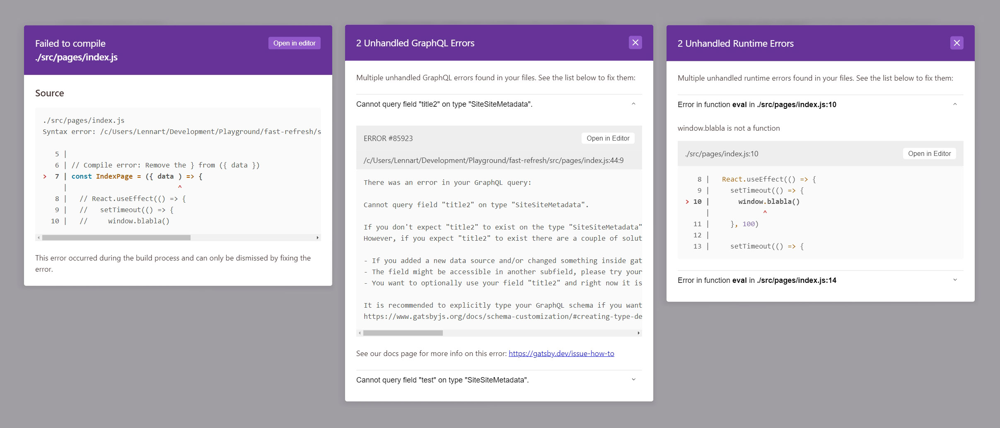

# v3.0 (March 2021 #1)

---

Welcome to `gatsby@3.0.0` release (March 2021 #1)

Key highlights of this release:

- [Incremental Builds in OSS](#incremental-builds-in-oss)
- [gatsby-plugin-image](#gatsby-plugin-image)
- [webpack 5](#webpack-5)
- [React 17](#react-17)
- [Fast Refresh](#fast-refresh)
- [jsx-factory & eslint-plugin](#todo)
- [Miscellaneous changes in plugins](#miscellaneous-changes-in-plugins)

Also check out [notable bugfixes](#notable-bugfixes).

**Bleeding Edge:** Want to try new features as soon as possible? Install `gatsby@next` and let us know
if you have any [issues](https://github.com/gatsbyjs/gatsby/issues).

[Previous release notes](/docs/reference/release-notes/v2.32)

[Full changelog](https://github.com/gatsbyjs/gatsby/compare/gatsby@2.32.0-next.0...gatsby@3.0.0)

## Breaking Changes

If you're looking for an overview of all breaking changes and how to migrate, please see the [migrating from v2 to v3 guide](/docs/reference/release-notes/migrating-from-v2-to-v3/).

## Incremental Builds in OSS

TODO

## `gatsby-plugin-image`

TODO

## webpack 5

TODO

## React 17

TODO

## Fast Refresh

After adding our initial Fast Refresh integration back in November 2020, we worked on it over the last couple of releases. For Gatsby v3 we further improved usability, reliability, and accessibility to make it the default overlay. With this the old `react-hot-loader` is removed and you can benefit from all the new features it has: Fast Refresh is faster, handles errors better, and preserves state across re-renders.

Here's a preview:



We built a custom error overlay that aims to give you helpful information to fix your bugs more quickly. It features:

- A clear indication whether it's a runtime error, compile error, or GraphQL error
- Source code snippets that you can open in your editor with the press of a button
- The exact error location, including the original line and column
- The overlay automatically goes away once you fix the error

We also added two new ESLint rules inside the default configuration that will warn you against anti-patterns in your code:

- No anonymous default exports
- Page templates must only export one default export (the page) and `query` as a named export

## babel-preset-gatsby

`babel-preset-gatsby` now accepts `reactImportSource` which is passed to the underlying `@babel/preset-react` importSource field. Note that this field is only supported when `reactRuntime` is `automatic`, it is `classic` by default.

Configuration looks like this.

```json
{
  "presets": [
    [
      "babel-preset-gatsby",
      {
        "reactRuntime": "automatic",
        "reactImportSource": "@emotion/react"
      }
    ]
  ]
}
```

## ESLint

Gatsby no longer uses the deprecated `eslint-loader`, we've moved to `eslint-webpack-plugin`.

## Miscellaneous changes in plugins

### `gatsby-transformer-remark`

When using the `tableOfContents` functionality, the defaults have changed. `absolute` now defaults to `false` and `pathToSlugField` defaults to an empty string.

### `gatsby-react-router-scroll`

`ScrollContainer`, previously deprecated, has now been removed. Please use the `useScrollRestoration`hook instead.

## Notable bugfixes

- Migrate to latest Contentful SDK in `gatsby-source-contentful`, via [PR #29520](https://github.com/gatsbyjs/gatsby/pull/29520)
- Add plugin options validation to `gatsby-plugin-canonical-urls`, via [PR #29688](https://github.com/gatsbyjs/gatsby/pull/29688)
- Support `topLevelImportPaths` option for `gatsby-plugin-styled-components`, via [PR #29544](https://github.com/gatsbyjs/gatsby/pull/29544)
- Drop `terminal-link` from our CLI as in some terminals it turned lines blank, via [PR #29472](https://github.com/gatsbyjs/gatsby/pull/29472)
- Update the `pathExist` function in `gatsby-plugin-feed`, via [PR #29616](https://github.com/gatsbyjs/gatsby/pull/29616)

## Contributors

A big **Thank You** to [our community who contributed](https://github.com/gatsbyjs/gatsby/compare/gatsby@2.31.0-next.0...gatsby@2.31.0) to this release 💜

TODO: Needs to be generated after with the script
